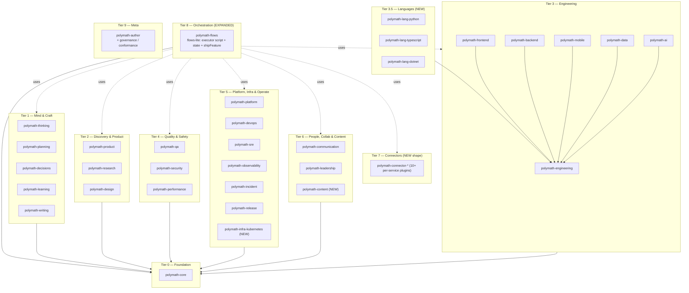
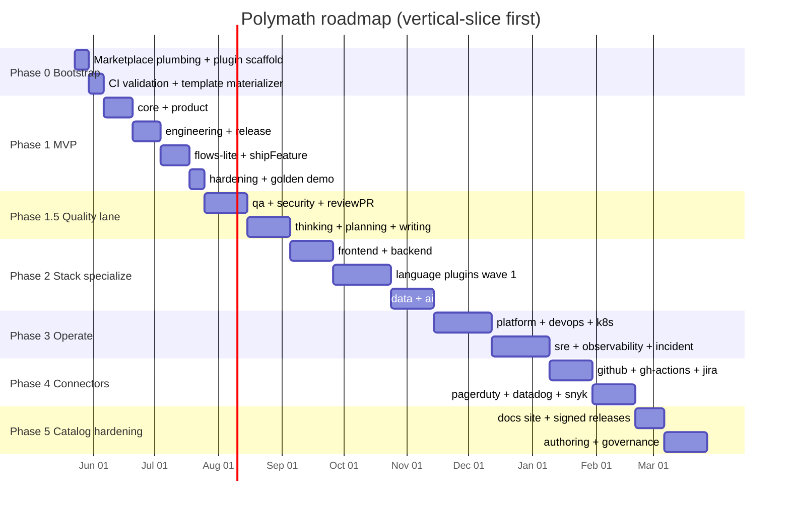

# Polymath — Claude Code Plugin Marketplace

> A public, open-source Claude Code marketplace of work-shaped plugins covering the full lifecycle of building software products — from idea to incident, from thinking-craft to platform engineering. Designed to be installable a-la-carte by real teams.

---

## 1. Context

**Repo state**: `MohammadBafkar/Polymath` is empty (README only, Claude Code GitHub Actions wired). Public OSS, no organizational tie-in.

**Audience**: individual contributors and small/medium engineering orgs who use Claude Code daily and want curated, role-shaped extensions instead of building everything from scratch.

**Goal**: a marketplace where someone installs `polymath-product` to get PM craft, `polymath-incident` to handle an outage, `polymath-flows` to orchestrate "idea → shipped feature" — and never has to load expertise they don't need.

**Why a marketplace, not a mega-plugin**:

- Per-plugin always-on token cost (skill/agent/command listings) is real; a single 200-component plugin loads them all every turn.
- Each function of a tech company (PM, design, eng, QA, sec, devops, SRE, …) has its own vocabulary, templates, and workflows. Mixing them creates noise.
- Plugins are the unit of trust, versioning, and distribution. Teams want to pin specific versions of specific concerns.

---

## 2. Research summary

| Project | Organizing principle | What we copy / avoid |
|---|---|---|
| `anthropics/claude-code/plugins` (13 plugins) | Workflow-shaped, cohesive 5–10 components per plugin | **Copy** the cohesion model; the `commands/` vs `skills/` convention. |
| `anthropics/claude-plugins-official` | Multi-axis: code-intelligence, integrations, dev-workflows, output styles | **Copy** the multi-axis split (integrations as their own concern). |
| `obra/superpowers` | Meta-craft (TDD, systematic-debugging, brainstorming, planning) bundled tight | **Copy** the meta-craft framing and reference-material bundling. |
| `dotnet/skills` | Domain-vertical plugins (dotnet-data, dotnet-aspnet, dotnet-ai, …) | **Copy** the per-domain granularity for stacks. |
| `wshobson/agents` (191 agents) | Role-specialist agents (python-pro, fastapi-pro, …) | **Selectively copy** the "role-pro" agent naming. **Avoid** the maximalism — most "pros" should be skills, not agents. |
| `github/awesome-copilot` | Primitive-based (agents/instructions/skills/hooks/plugins/workflows) | **Avoid** primitive-based top-level split — it doesn't match how teams adopt tools. |
| `davila7/claude-code-templates`, `hesreallyhim/awesome-claude-code` | Curated catalogs | **Inspiration** for discoverability and contribution flow. |

**Industry frameworks** used as substance of templates and skills (all real, all standard): PRD/PRFAQ, ADR (Michael Nygard), RFC, Diátaxis, Conventional Commits, semver, OKR, RICE/ICE, JTBD, Kano, North Star, RAPID, DACI, OODA, MECE, 5-Whys, Fishbone, Six Thinking Hats, SCAMPER, First Principles, STRIDE, OWASP Top 10, SLSA, NIST CSF, SOC2/GDPR/ISO27001, SLO/SLI/error-budgets, DORA, SPACE, Team Topologies, C4 model, Conway's Law.

---

## 2.1 Implementation status

> Single source of truth for "what's done". Updated after every material batch of work (see [`feedback_plan_progress.md`](.claude/projects/.../memory/feedback_plan_progress.md) memory).

| Phase | Status | Notes |
|---|---|---|
| Phase 0 — Bootstrap | `[done]` 2026-05-23 | marketplace.json, LICENSE, shared/templates, shared/schemas/workflow.schema.json, tools/, CI workflows, docs, CODEOWNERS. Commits `d4b3a29`, `17c0dcc`. |
| Phase 1a — `polymath-core` + `polymath-product` | `[done]` 2026-05-23 | Commits `3ce84aa`, `e93292f`. |
| Phase 1b — `polymath-engineering` + `polymath-release` | `[done]` 2026-05-23 | Commits `1d43942`, `70fc07d`. |
| Phase 1c — `polymath-flows` (flows-lite + shipFeature) | `[done]` 2026-05-23 | Commit `8b1ba21`. |
| Phase 1d — hardening + golden demo | `[done]` 2026-05-24 | Golden-fixture spec, 13 `bin/polymath-flow` unit tests, CI `executable-unit` / `executable-e2e` / `fixtures-parse` jobs, CLI-based fixture runner. Commits `afa18bf`, `e9f20ff`, `45c20c3`, `f493089`. Live `claude` smoke verified end-to-end: marketplace add, install ×5, `claude plugin details` reports 1,007 / 1,500 tokens, `claude -p` invokes `/plugin-budget` and `/list-workflows` correctly, and `shipFeature` start persists state that a later session can see. Full 7-step Claude-driven shipFeature walk deferred (would consume significant tokens; orchestration substrate proven). |
| Phase 1.5 — Quality lane (qa, security, thinking, planning, writing, reviewPR) | `[done]` 2026-05-24 | All three substrate items shipped (S1 topology label, S2 SessionStart queue, S3 artifact schemas + artifactValid). Five plugins shipped + `reviewPR` fanout workflow. Commits `9cdc38c`, `43b33cd`, `b3862ab`, `4c724c6`, `0bff86c`, `dacc1d5`, `d6543fd`, `492bf19`, `2262d7e`, `0f63772`. |
| Phase 2 — Stack specialize (frontend, backend, lang wave 1, data, ai) | `[done]` 2026-05-24 | 7 plugins (frontend, backend, lang-python, lang-typescript, lang-dotnet, data, ai) + 7 golden fixtures. Per-plugin live measurement; descriptions trimmed for lang plugins to stay under 400-tok cap. Commits `eab1655`, `d245fa7`, `e0efaea`, `e521370`, `ec3fb0e`, `98de18f`, `de0933e`, `87f315d`, `bb49a1d`. |
| Phase 3 — Operate (platform, devops, k8s, sre, observability, incident) | `[done]` 2026-05-24 | 6 plugins + 6 golden fixtures + Postmortem/Comms-update templates + kubectl-prod-confirm PreToolUse hook. No workflow (waits for Phase 4 connectors per PLAN.md sec 10). Commits `b2f71aa`, `ff11640`, `813c0c2`, `aefcefc`, `8a1fa54`, `08dceda`, `b4f4cc5`. |
| Phase 4 — Connectors (github + gh-actions + jira; pagerduty + datadog + snyk) | `[done]` 2026-05-24 | 6 connector plugins + 6 golden fixtures + `respondToIncident` workflow (the first multi-connector flow, now legitimate per PLAN.md sec 10). Commits `fb6936e`, `3cb144e`, `f0efc5a`, `78a8b63`, `62c52f4`, `c9d556b`, `2489203`. |
| Phase 5 — Catalog hardening (Pages, signed releases, governance) | `[done]` 2026-05-24 | `polymath-author` plugin + `tools/new-connector.sh` + `tools/conformance.sh` (12-criterion schema) + `tools/build-catalog.py` (GitHub Pages generator) + 2 new CI workflows (pages, release) + `docs/PRIVACY.md` (no-telemetry policy + opt-in contract) + 6 backfilled golden fixtures. Commits `eff6abd`, `0fb0787`, `eedfd64`, `4dc8490`. |

Local gates green as of 2026-05-24 (post Phase 5):

- `claude plugin validate --strict` on all 30 plugins.
- `tools/lint-skills.sh` green.
- `tools/token-budget.sh` heuristic 3,359 / 7,500 (target scales with plugin count).
- `claude plugin details` authoritative measurement: 5,942 tokens across 30 plugins; 198/plugin average; max 345 (under the 400 cap).
- `tools/conformance.sh --all` green (12-criterion schema; every plugin satisfies the 8 required criteria).
- `tools/build-catalog.py --check` reproducible (30 plugin pages + index + CSS).
- `bin/polymath-flow validate` green on `shipFeature.yaml`, `reviewPR.yaml`, and `respondToIncident.yaml`.
- `python3 -m unittest discover -s plugins/polymath-flows/tests`: 22/22 pass.
- Live `claude -p` invocations (across phases): `/polymath-core:plugin-budget`, `/polymath-flows:list-workflows`, `shipFeature` start, `polymath-thinking:5-whys`, `polymath-backend:api-design-rest`, `polymath-sre:slo-design`, `polymath-connector-snyk:triage-vulns`, `polymath-author:skill-author-critic` — all route + execute correctly. Plus a fake-kubeconfig smoke of the `polymath-infra-kubernetes` PreToolUse hook, and a Jira-key detect-vs-vendor-ID test (vendor IDs correctly ignored).

CI runs green for: `validate.yml`, `token-budget.yml`, `lint.yml`, `link-check.yml`, the `executable-unit` / `executable-e2e` / `fixtures-parse` jobs of `golden-tests.yml`, and `pages.yml` (publishes the GitHub Pages catalog from `docs/site/`). The `claude-cli-fixtures` job is wired but skipped until `CLAUDE_CODE_OAUTH_TOKEN` (or `ANTHROPIC_API_KEY`) is added to repo secrets. `release.yml` is a manual `workflow_dispatch` plugin-version tagger (dry-run by default).

**Immediate next milestone:** all five phases of the original PLAN are now `[done]`. Polymath v0.1 is feature-complete per its own design.

Roadmap beyond v0.1 is the work surfaced in PLAN.md sec 3 that was explicitly deferred:

- Connector wave 3+ (slack, figma, sentry, notion, linear, asana, aws, gcp, azure, stripe, vercel, cloudflare, elastic, grafana, honeycomb).
- Language wave 2 (go, rust, java, swift, kotlin, ruby, php).
- Infra waves (aws, gcp, azure, terraform-stack, docker, postgres, redis).
- More workflows: `bugTriage`, `perfRegression`, `refactorWithSafety`, `securityFinding`, `sunsetCapability`, `featureFromIdea`, `experimentToGA`, `bumpDependency`, `migrateLanguageVersion`.
- More tier-1 craft (`polymath-decisions`, `polymath-learning`, `polymath-research`, `polymath-design`, `polymath-mobile`, `polymath-performance`, `polymath-communication`, `polymath-leadership`, `polymath-content`).
- Live `claude -p` golden fixtures wired into CI once `CLAUDE_CODE_OAUTH_TOKEN` is in repo secrets.
- Submit proven plugins to the community marketplace.

---

## 3. Ideas absorbed from your tree (additions to the original tier plan)

The tree you shared earlier surfaced eight concrete gaps in the original tier plan. Each is integrated into the catalog below as a targeted addition, not a replacement:

| Gap your tree exposed | Where it lands in the tier plan |
|---|---|
| Per-language tooling (pytest/ruff/biome/vitest/xunit/csproj) | **New Tier 3.5**: `polymath-lang-python`, `polymath-lang-typescript`, `polymath-lang-dotnet` (+ roadmap for go/rust/java/swift/kotlin/ruby/php) |
| Per-platform infrastructure depth (k8s manifests, RBAC, PSS) | **New in Tier 5**: `polymath-infra-kubernetes` (+ roadmap for aws/gcp/azure/terraform-stack/docker/postgres/redis) |
| Per-service connectors (github, jira, datadog, …) with hooks + MCP | **Tier 7 reshaped**: `polymath-integrations` mega-plugin is replaced by per-service `polymath-connector-*` plugins |
| Outward-facing content (DX, support, localization, sunsets, advisories) | **New in Tier 6**: `polymath-content` |
| Workflow YAML as a primitive (guards, state, deterministic checks first; DAG later) | **Tier 8 expanded**: `polymath-flows` ships flows-lite first, then grows toward the Conductor pattern — see § 11 |
| Governance / conformance (audit-officer, ethics/license/vendor review) | **Tier 9 expanded**: governance components added to `polymath-author` |
| Specific skill gaps (clarify, decompose, hypothesize, read-code, run-pia, run-dr-drill, track-finops, code-author agent, system-architect-lite) | Distributed into the relevant existing plugins |
| Workflow library names (bugTriage, perfRegression, refactorWithSafety, respondToIncident, reviewPR, securityFinding, shipFeature, sunsetCapability) | `shipFeature` ships first; the rest become the later `polymath-flows/workflows/*.yaml` bundle |

These additions describe the long-term catalog, not the first ship target. The old MVP was too broad and internally inconsistent, so v0.1 is now a narrow vertical slice: five plugins, one workflow, deterministic validation, and no connector/governance/platform scope. Everything else remains opt-in roadmap material after the vertical slice proves the plugin mechanics.

---

## 4. Design principles

### 4.1 Component-type decision matrix

```
Need → Component
─────────────────────────────────────────────────────────────────
Event-driven gate (block secrets, format on save, push reminder) → HOOK
External service tool calls (Jira create, Sentry fetch, …)        → MCP server
Persistent background watcher (logs, CI, deploy status)           → MONITOR
Per-language code intel                                           → LSP plugin (compose official)
Specialist isolated context (deep audit, panel review, research)  → AGENT
Quick alias / flow orchestrator / no supporting files             → COMMAND (flat .md in commands/)
Procedure with templates, scripts, examples, or refs              → SKILL (directory with SKILL.md)
```

**Output styles** are deliberately out — Anthropic is steering authors toward skills for tone control. Where Polymath wants a tone preset (terse, exec-brief, teaching), it ships a reference-content skill instead.

### 4.2 Commands vs Skills

Both produce `/name` invocations and accept the same frontmatter. They differ only in directory shape and intent:

| | Command (`commands/foo.md`) | Skill (`skills/foo/SKILL.md`) |
|---|---|---|
| File shape | Single flat `.md` | Directory + `SKILL.md` + supporting files |
| Best for | Aliases, flow orchestrators, short procedures | Procedures with templates / scripts / references |
| Token cost | Identical listing cost; body loads on invoke | Identical |
| Auto-invocation | Yes (via `description`) | Yes (via `description`) |
| Polymath usage | `polymath-flows/*` chain commands, `/commit`, `/standup`, `/exec-brief` aliases | `/prd`, `/feature-dev`, `/a11y-audit`, `/postmortem` (need bundled templates or scripts) |

When both a command and a skill share a name (e.g., `/brainstorm` exists as both), the **command is a thin alias** (≤ 20 lines) pointing to the skill; the skill holds the canonical content.

### 4.3 Agent rules

Reserve agents for:

- Panels of critics running in parallel (security + perf + a11y + simplification).
- Heavy research / audit that would flood the main context.
- Distinct roles the user explicitly addresses ("ask the PM critic", "let the incident-commander run this").

Where current Claude Code frontmatter supports it, prefer forked context for one-shot isolated work before writing a custom agent file.

**Three Claude Code subagent constraints authors must design around** (verify against current Claude Code docs before relying on any of these — they were true at time of writing and shape the agent surface materially):

1. **Plugin-shipped subagents cannot ship their own hooks, MCPs, or `permissionMode`.** Only top-level plugin hooks/MCPs are honored. Any deterministic gating around an agent lives at plugin scope, not on the agent file.
2. **Subagents cannot spawn subagents.** Hierarchy is one level deep. Multi-step pipelines compose through the workflow runner (`polymath-flows`) advancing a state machine, not through nested agent calls.
3. **Subagent execution is synchronous from the caller's view.** The lead agent waits for each subagent to return before continuing. Any "parallel panel" topology must be fanned out by the executor, not by an agent dispatching siblings.

`polymath-author` encodes these in `/new-agent` so contributors do not design around capabilities Claude Code does not expose.

### 4.4 Plugin sizing

- **Always-on token budget**: ≤ 400 tokens per plugin (≈ 8–12 component listings).
- **Single responsibility**: one role, workflow stage, language, infra target, or external service per plugin.
- **Cross-plugin reuse**: declared via `dependencies` in `plugin.json` whenever a shipped workflow or default skill expects another plugin to be installed. "Invocation-time composition" is allowed only for optional suggestions and must degrade cleanly when the target plugin is absent.
- **SKILL.md ≤ 500 lines**; reference material spills to `reference.md` or `references/<topic>.md`.
- **Description discipline**: ≤ 200 chars, trigger phrase first.

### 4.5 Naming

- Plugins: `polymath-<bare-name>` (kebab-case).
- Skills/commands: bare file names (`prd`, `feature-dev`, `commit`); user-facing invocation is namespaced (`/polymath-product:prd`, `/polymath-engineering:feature-dev`, `/polymath-release:commit`) unless a user defines their own local alias.
- Agents: nouns-of-people (`security-reviewer`, `pm-critic`, `architect`, `code-author`).
- Templates: PascalCase artifact names (`PRD.md`, `ADR.md`).
- Workflow YAMLs: camelCase (`shipFeature.yaml`, `bugTriage.yaml`).

### 4.6 Topology vocabulary (for future flows)

Anthropic's "Building effective agents" essay names five composition patterns. Polymath adopts the vocabulary even though v0.1 only uses *series*. Naming the patterns up front lets future workflows (`reviewPR`, `bugTriage`, `respondToIncident`) declare a topology instead of inventing one.

| Pattern | When to use | Where Polymath would use it |
|---|---|---|
| **Series (prompt chaining)** | Task decomposes into fixed, ordered subtasks. Default for code-touching work. | `shipFeature` (v0.1), `bumpDependency`, `migrateLanguageVersion`. |
| **Parallel fan-out + reducer** | Independent subtasks; multiple perspectives needed; or work that exceeds a single context window. | `reviewPR` (security + perf + a11y + simplification critics → synthesizer). |
| **Brainstorm / debate (parallel + vote)** | Open-ended ideation; alternatives matter more than convergence. | ADR alternatives, PRD critique, naming. |
| **Orchestrator-workers** | Subtasks can't be predicted up front (e.g., the set of files to change depends on the task). | Future `featureFromIdea` once a routing layer exists. |
| **Evaluator-optimizer loop** | Clear rubric + iterative improvement gives measurable value. | `a11y-audit`, security rubric scoring, content polishing. Bounded by max iterations and budget. |

Effort-scaling heuristic (paraphrasing Anthropic's multi-agent research writeup — verify before quoting exact figures): simple fact-finding ≈ 1 agent with a few tool calls; comparative analysis ≈ 2–4 agents; complex multi-source research ≈ 10+ agents with clearly divided responsibilities. Polymath's default disposition is *single worker* — fan-out is opt-in per workflow because multi-agent runs consume materially more tokens than a single session (Anthropic publicly cites a ~15× multiplier for their research system; treat it as directional, not authoritative for coding workloads).

A topology label is recorded in each workflow step (`topology: series|fanout|debate|orchestrator|evaluator-optimizer`) once Phase 1.5 lands; v0.1 implies `series` for every step.

---

## 5. Marketplace shape



Solid arrows = hard `plugin.json` dependency. Dashed = invocation-time composition (a flow uses skills/agents from other plugins).

### SDLC coverage

```
Idea ─► Discover ─► Spec ─► Design ─► Build ─► Review ─► Test ─► Ship ─► Operate ─► Learn ─► Lead ─► Communicate-externally
  │       │          │       │         │         │         │       │        │          │       │       │
think   research    prod   design     eng     eng/qa/sec   qa    release  obs/sre/inc  retro  leadership content
write   prod       write   write    fe/be/                                            learn   comm
                                    data/ai/
                                    lang-*/
                                    infra-*/
```

`polymath-flows` is the conductor that chains across stages.

---

## 6. The full plugin catalog

Format per plugin: skills `[s]`, commands `[c]`, agents `[a]`, hooks `[h]`, MCPs `[m]`, monitors `[mon]`, templates `[t]`, references `[r]`.

### Tier 0 — Foundation

**polymath-core** *(implicit dependency of everything in tier 1+)*

- `[s]` `conventions`, `glossary` — project conventions and shared vocabulary loaded by name
- `[c]` `/tldr` (turn-end summarizer), `/ultrathink` (toggle), `/plugin-budget` (current always-on cost report)
- `[s]` `tone-terse`, `tone-exec-brief`, `tone-teaching` — reference-content skills replacing the old output styles (per § 4.1)
- `[h]` `SessionStart` → print active polymath plugins + any paused workflows; `Stop` → nudge "summarize the change"
- Kept thin so the always-on cost stays low.

### Tier 1 — Mind & Craft

**polymath-thinking**

- `[s]` `brainstorm`, `divergent-converge`, `six-hats`, `scamper`, `first-principles`, `inversion`, `pre-mortem`, `5-whys`, `fishbone`, `mece`, `ooda-loop`, `red-team`, `clarify` *(NEW from tree)*, `decompose` *(NEW)*, `hypothesis-test` *(NEW)*
- `[a]` `critic` (devil's advocate), `synthesizer` (panel aggregator)
- `[c]` `/think-out-loud`, `/red-team`, `/clarify`

**polymath-planning**

- `[s]` `write-plan`, `execute-plan`, `work-breakdown`, `dependency-map`, `critical-path`, `raid-log`, `sprint-plan`, `roadmap-narrative`, `gantt-spec`, `status-report`, `weekly-review`, `estimate` *(NEW)*
- `[a]` `planner`, `pm-coach`
- `[c]` `/plan`, `/standup`, `/weekly`
- `[t]` `Plan.md`, `RAID-log.md`, `Status-report.md`, `Sprint-plan.md`, `Roadmap.md`

**polymath-decisions**

- `[s]` `decision-record` (Nygard ADR), `daci`, `rapid`, `tradeoff-matrix`, `risk-register`, `cynefin-frame`, `weighted-criteria`, `pre-mortem-decision`
- `[c]` `/decide` (DACI walkthrough), `/adr`
- `[t]` `ADR.md`, `DACI-decision.md`, `Tradeoff-matrix.md`, `Risk-register.md`

**polymath-learning**

- `[s]` `explain-like-im-5`, `explain-like-a-senior`, `code-walkthrough`, `learning-path`, `spaced-recall`, `concept-map`, `knowledge-synthesis`, `pair-programming-mentor`, `socratic-q-and-a`, `feynman-technique`
- `[a]` `mentor`, `tutor`
- `[c]` `/teach`, `/explain` (with audience arg), `/walkthrough <path>`

**polymath-writing**

- `[s]` `readme`, `api-docs`, `architecture-doc` (C4), `runbook`, `tutorial-diataxis`, `how-to`, `reference-doc`, `release-notes`, `diagram-mermaid`, `editorial-pass` (Strunk-and-White cleanup)
- `[a]` `docs-editor`, `diataxis-classifier`
- `[t]` `README.md`, `Runbook.md`, `Architecture-doc.md`, `API-docs.md`, `Tutorial.md`, `How-to.md`, `Reference.md`, `Release-notes.md`, `RFC.md`

### Tier 2 — Discovery & Product

**polymath-product** *(v0.1 materializes its own templates; later may reuse polymath-writing conventions)*

- `[s]` `prd`, `prfaq`, `one-pager`, `user-story`, `acceptance-criteria`, `jtbd`, `score-rice`, `score-ice`, `kano-model`, `okr`, `north-star`, `value-proposition-canvas`, `release-narrative`, `competitor-scan`, `decompose-epic` *(also lives in product)*, `measure-adoption` *(NEW from tree)*, `synthesize-interviews` *(NEW)*
- `[a]` `pm-critic`, `pmm`, `customer-empath`, `product-manager` *(NEW)*, `market-researcher` *(NEW)*
- `[t]` `PRD.md`, `PRFAQ.md`, `One-pager.md`, `User-story-map.md`, `JTBD-canvas.md`, `OKR.md`, `North-star.md`, `Value-prop-canvas.md`

**polymath-research**

- `[s]` `market-scan`, `discovery-plan`, `user-research-plan`, `interview-guide`, `survey-design`, `affinity-synthesis`, `persona-build`, `customer-journey-map`, `assumption-mapping`
- `[a]` `research-synthesizer`, `competitive-analyst`
- `[t]` `Interview-guide.md`, `Persona.md`, `Customer-journey.md`, `Assumption-map.md`

**polymath-design**

- `[s]` `ui-critique`, `a11y-audit` (WCAG 2.2 AA), `design-system-conformance`, `wireframe-ascii`, `wireframe-mermaid`, `microcopy`, `empty-states`, `error-states`, `motion-spec`, `visual-hierarchy-check`
- `[a]` `design-critic`, `a11y-reviewer`, `brand-guardian`, `ui-designer` *(NEW from tree)*
- `[h]` warn on PR with UI changes but no a11y mention
- `[r]` WCAG quick-ref, Material/HIG/Fluent cheat-sheets

### Tier 3 — Engineering

**polymath-engineering** *(generic craft; FE/BE/mobile/data/ai/lang-* extend it)*

- `[s]` `feature-dev` (TDD loop), `refactor`, `simplify`, `debug-systematic`, `perf-investigation`, `code-review` (correctness + simplification), `architecture-review`, `dep-update`, `dead-code-hunt`, `verify-change`, `propose-pr` *(NEW from tree)*, `read-code` *(NEW — orientation in new codebase)*
- `[a]` `architect`, `reviewer-correctness`, `reviewer-simplification`, `debugger`, `refactorer`, `code-author` *(NEW from tree — writes code from spec)*, `system-architect-lite` *(NEW from tree — quick sanity-check vs full architect)*
- `[h]` `PreToolUse(Write|Edit)` → block secrets (regex + entropy); `PostToolUse(Edit|Write)` → run project formatter if config present; `scripts/gate-pr-open.sh`, `scripts/route-to-review.sh` *(NEW from tree)*
- `[c]` `/review-this`, `/explain-this`, `/implement`, `/review`

**polymath-frontend** *(depends on polymath-engineering)*

- `[s]` `component-design`, `state-machine-xstate`, `web-vitals-budget`, `bundle-analyze`, `framework-migrate`, `responsive-audit`, `css-architecture`
- `[a]` `react-pro`, `vue-pro`, `svelte-pro`, `nextjs-pro`, `frontend-perf-reviewer`
- `[r]` web vitals thresholds, common CLS/INP fixes

**polymath-backend** *(depends on polymath-engineering)*

- `[s]` `api-design-rest`, `api-design-graphql`, `db-schema`, `migration-plan`, `idempotency`, `queue-design`, `caching-strategy`, `auth-flows`, `rate-limiting`, `tenant-isolation`
- `[a]` `api-architect`, `db-architect`, `node-pro`, `python-pro`, `go-pro`, `java-pro`, `ruby-pro`

**polymath-mobile** *(depends on polymath-engineering)*

- `[s]` `ios-arch`, `android-arch`, `rn-arch`, `flutter-arch`, `push-notifications`, `deep-links`, `app-store-release`, `play-store-release`, `mobile-perf`
- `[a]` `ios-pro`, `android-pro`, `rn-pro`, `flutter-pro`

**polymath-data**

- `[s]` `sql-write`, `sql-optimize`, `dbt-model`, `etl-design`, `lineage-map`, `dashboard-spec`, `metrics-tree`, `data-quality`, `pii-tagging`, `define-pipeline` *(NEW)*, `run-experiment` *(NEW)*, `train-model` *(NEW)*, `promote-model` *(NEW)*
- `[a]` `data-engineer`, `analytics-engineer`, `bi-reviewer`, `ml-engineer` *(NEW)*, `experimenter` *(NEW)*
- `[t]` `Pipeline.yaml`, `Train-spec.md`, `Experiment.md`

**polymath-ai**

- `[s]` `prompt-engineer`, `rag-design`, `eval-plan`, `eval-build`, `agent-design`, `tool-design`, `cost-optimize`, `anthropic-sdk-helper`, `model-migration` (between current Anthropic model releases)
- `[a]` `prompt-critic`, `eval-judge`, `ai-architect`
- `[r]` prompt-caching patterns, RAG eval rubrics

### Tier 3.5 — Languages (NEW)

Each language plugin depends on `polymath-engineering` and follows the same shape: 2 agents (test-author + linter), 2–3 commands, 3 skills (lint, write-tests, language-specific modernization).

**polymath-lang-python**

- `[a]` `pytest-author`, `ruff-linter`
- `[c]` `/pytest`, `/ruff`, `/types-py`
- `[s]` `lint-with-ruff` (with `scripts/`), `propose-type-annotations` (with `scripts/`), `write-pytest-test` (with `references/pytest-idioms.md`)
- `[h]` `PostToolUse(Write|Edit)` on `**/*.py` → run ruff + mypy/pyright if configured

**polymath-lang-typescript**

- `[a]` `biome-linter`, `vitest-author`
- `[c]` `/biome`, `/vitest`, `/ts-migrate`
- `[s]` `lint-with-biome`, `migrate-ts-version`, `write-vitest-test` (with `references/vitest-idioms.md`)
- `[h]` `PostToolUse(Write|Edit)` on `**/*.{ts,tsx}` → run biome + tsc --noEmit

**polymath-lang-dotnet**

- `[a]` `csproj-auditor`, `xunit-author`
- `[c]` `/csproj-audit`, `/xunit`, `/nullable`
- `[s]` `audit-csproj-modernization`, `propose-nullable-references`, `write-xunit-test` (with `references/xunit-idioms.md`)

**Roadmap**: `polymath-lang-go`, `polymath-lang-rust`, `polymath-lang-java`, `polymath-lang-swift`, `polymath-lang-kotlin`, `polymath-lang-ruby`, `polymath-lang-php` (after language wave 1 proves the pattern).

### Tier 4 — Quality & Safety

**polymath-qa**

- `[s]` `test-strategy`, `test-pyramid`, `unit-tests`, `integration-tests`, `e2e-playwright`, `contract-tests`, `mutation-testing`, `flake-hunt`, `coverage-gap`, `test-data-builders`
- `[a]` `qa-strategist`, `test-author`, `flake-detective`
- `[h]` warn on PR touching critical paths without new tests

**polymath-security**

- `[s]` `stride-threat-model`, `owasp-review`, `secret-scan`, `supply-chain-audit` (SLSA), `crypto-review`, `authz-review`, `compliance-soc2`, `compliance-gdpr`, `compliance-iso27001`, `run-pia` *(NEW from tree — Privacy Impact Assessment)*, `review-iam` *(NEW)*, `write-advisory` *(may live here or in polymath-content; default: content)*
- `[a]` `security-reviewer`, `appsec-architect`, `compliance-officer`, `threat-modeler`, `iam-reviewer`, `privacy-officer`
- `[h]` `PreToolUse(Write|Edit)` → secret/key/JWT scan; `UserPromptSubmit` → warn if user paste contains credentials
- `[r]` OWASP Top 10 (current year), STRIDE table, NIST CSF
- `[t]` `Threat-model.md`, `PIA.md`

**polymath-performance**

- `[s]` `perf-budget`, `load-test-plan`, `profile-cpu`, `profile-mem`, `frontend-vitals`, `backend-tail-latency`, `db-query-perf`, `caching-tradeoffs`
- `[a]` `perf-engineer`, `perf-reviewer`

### Tier 5 — Platform, Infrastructure & Operate

**polymath-platform**

- `[s]` `idp-design`, `golden-path`, `paved-road`, `service-catalog-entry`, `backstage-template`, `developer-survey`, `devex-metrics` (DORA, SPACE), `team-topologies-map`, `improve-dx` *(may also live in polymath-content; platform owns the metrics, content owns the artifact)*
- `[a]` `platform-engineer`, `devex-researcher`
- `[r]` DORA metrics, SPACE framework, Team Topologies primer

**polymath-devops**

- `[s]` `dockerize`, `compose-design`, `k8s-manifest` *(generic; depth in polymath-infra-kubernetes)*, `helm-chart`, `kustomize-overlay`, `terraform-module`, `pulumi-stack`, `ci-pipeline-github`, `ci-pipeline-gitlab`, `gitops`, `env-promotion`, `apply-iac` *(NEW)*, `run-pipeline` *(NEW)*
- `[a]` `iac-reviewer`, `k8s-reviewer`

**polymath-sre**

- `[s]` `slo-design` (SLI/SLO/error-budget), `error-budget-policy`, `capacity-plan`, `runbook-author`, `chaos-experiment`, `toil-reduction`, `oncall-design`, `run-dr-drill` *(NEW from tree)*, `define-backup-policy` *(NEW)*, `track-finops` *(NEW from tree)*
- `[a]` `sre-reviewer`, `sre-architect`, `finops-officer` *(NEW)*
- `[r]` Google SRE workbook patterns
- `[t]` `Backup-policy.md`, `FinOps-review.md`

**polymath-observability**

- `[s]` `logging-strategy`, `tracing-strategy-otel`, `metrics-design` (RED, USE), `alert-design`, `dashboard-spec`, `slo-burn-policy`, `log-noise-cleanup`, `observe` *(generic top-level)*
- `[a]` `observability-architect`, `sre-observer`
- `[mon]` optional log/CI tails

**polymath-incident**

- `[c]` `/incident-start`, `/sev1`, `/sev2`, `/war-room`, `/comms-update`, `/incident-from-alert`
- `[s]` `incident-triage`, `incident-runbook`, `war-room-template`, `comms-template`, `postmortem-blameless`, `action-items`, `incident-timeline`, `triage-incident` *(alias to incident-triage)*
- `[a]` `incident-commander`, `comms-lead`, `postmortem-facilitator`
- `[t]` `Postmortem.md`, `Runbook.md`, `Comms-update.md`, `Incident-timeline.md`

**polymath-release**

- `[c]` `/commit` (Conventional Commits), `/pr`, `/changelog`, `/release-notes`, `/rollback-plan`, `/release`, `/dora`
- `[s]` `semver-bump`, `feature-flag-plan`, `canary-plan`, `blue-green-plan`, `release-train`, `release` *(top-level release procedure)*, `emit-dora` (computes DORA from git/CI; `scripts/compute-dora-metrics.sh`)
- `[a]` `release-manager`
- `[h]` pre-push reminder for CHANGELOG; PR title linter against Conventional Commits

**polymath-infra-kubernetes** *(NEW — depth for k8s)*

- `[a]` `k8s-manifest-author`, `k8s-rbac-auditor`
- `[c]` `/k8s-manifest`, `/k8s-pss`, `/k8s-rbac-audit`
- `[s]` `write-manifest` (with `references/manifest-defaults.md`), `audit-rbac-grants`, `propose-pod-security-standards`
- `[h]` `PreToolUse(Bash)` on `kubectl apply` → require confirm if context is prod

**Roadmap**: `polymath-infra-aws`, `polymath-infra-gcp`, `polymath-infra-azure`, `polymath-infra-terraform-stack`, `polymath-infra-docker`, `polymath-infra-postgres`, `polymath-infra-redis` (Phases 4–5).

### Tier 6 — People, Collab & Content

**polymath-communication** *(internal-facing)*

- `[c]` `/exec-brief`, `/standup-async`, `/stakeholder-update`, `/slack-thread`, `/email-tone`
- `[s]` `rfc-review-comment`, `meeting-notes`, `bluf` (bottom line up front), `narrative-six-pager` (Amazon-style)
- `[t]` `Exec-brief.md`, `Stakeholder-update.md`, `Six-pager.md`

**polymath-leadership**

- `[s]` `one-on-one-prep`, `perf-review`, `hiring-loop`, `interview-debrief`, `okr-setting`, `team-charter`, `career-ladder`, `decision-framework-team`, `change-management`
- `[a]` `coach`, `hiring-panel-synthesizer`
- `[t]` `1-on-1.md`, `Perf-review.md`, `Career-ladder.md`, `Team-charter.md`

**polymath-content** *(NEW from tree — outward / customer-facing)*

- `[a]` `technical-writer` *(blog posts, public docs)*, `dx-engineer`, `loc-engineer`, `support-rep`, `sunset-officer`, `advisory-author`
- `[c]` `/doc`, `/dx`, `/localize`, `/support`, `/sunset-notice`, `/advisory`, `/release-notes` *(alias)*
- `[s]` `write-doc`, `improve-dx`, `localize`, `handle-support-ticket`, `write-sunset-notice`, `write-advisory`, `write-release-notes` *(canonical home; polymath-release/-writing alias here)*, `write-status-update` *(customer-facing status; internal version is in polymath-communication)*
- `[t]` `Sunset-notice.md`, `Advisory.md`, `Localization-plan.md`, `Support-response.md`, `Customer-status-update.md`

### Tier 7 — Connectors *(NEW shape — replaces polymath-integrations)*

One plugin per external service. Standard layout per connector:

```
polymath-connector-<service>/
├── .claude-plugin/plugin.json     # userConfig: API token, sensitive: true
├── .mcp.json                      # MCP server for tool calls
├── hooks/
│   ├── hooks.json                 # event-driven reactions
│   └── scripts/                   # webhook/poll handlers
├── monitors/monitors.json         # optional: tail status
├── skills/                        # thin wrappers when useful
└── references/<service>-tools.md  # what the MCP exposes
```

| Connector | Hook events | MCP tools | Monitors |
|---|---|---|---|
| `polymath-connector-github` | `UserPromptSubmit` PR-URL → fetch context; `Stop` → suggest PR | `pr.create/view/comment`, `issue.create/view`, `repo.fetch-file` | CI tail (optional) |
| `polymath-connector-github-actions` | `Stop` → suggest re-run on failure | `workflow.run/view/dispatch` | workflow-status tail |
| `polymath-connector-jira` | `UserPromptSubmit` PROJ-123 → fetch issue | `issue.create/get/update/transition`, `search`, `comment` | sprint tail (optional) |
| `polymath-connector-kubernetes` | `PreToolUse(Bash)` on `kubectl apply` → confirm in prod | `apply/delete/get`, `logs`, `exec` | none |
| `polymath-connector-datadog` | none | `query.metrics/logs/events`, `dashboard.list` | alert monitor |
| `polymath-connector-pagerduty` | `UserPromptSubmit` incident-URL → fetch | `incident.create/ack/resolve`, `oncall.now` | active incidents tail |
| `polymath-connector-launchdarkly` | `Stop` → suggest flag check | `flag.list/get/update`, `environments.list` | rollout tail |
| `polymath-connector-snyk` | `Stop` → warn on open critical | `test`, `monitor`, `list-issues` | none |
| `polymath-connector-statuspage` | `Stop` → suggest status update during incident | `incident.create/update`, `component.update` | none |
| `polymath-connector-terraform` | `PreToolUse(Bash)` on `terraform apply` → confirm; `PostToolUse` → audit log | `plan/apply` (sandboxed), `state.show` | none |

**Future connectors** (after connector wave 1 proves the pattern): `connector-slack`, `connector-figma`, `connector-sentry`, `connector-notion`, `connector-linear`, `connector-asana`, `connector-aws`, `connector-gcp`, `connector-azure`, `connector-stripe`, `connector-vercel`, `connector-cloudflare`, `connector-elastic`, `connector-grafana`, `connector-honeycomb`.

**Optional convenience meta-plugin** (deferred): `polymath-connectors-developer-bundle` declares deps on github + jira + pagerduty + sentry; `polymath-connectors-platform-bundle` declares deps on kubernetes + terraform + datadog + pagerduty. No content of their own — just dependency lists.

### Tier 8 — Orchestration *(flows-lite first, Conductor later)*

**polymath-flows** *(v0.1 depends on core + product + engineering + release)*

Hosts flows-lite in v0.1, with the larger Conductor pattern deferred until the serial runner is proven. Components:

- `[s]`:
  - `run-workflow` — drives the workflow loop while `bin/polymath-flow` validates YAML, tracks state, and runs `mustPass`
  - `resume-workflow` — load state and replay from the last completed step
  - `list-workflows` — inventory active / paused / completed
  - `explain-workflow` — plain-English walk-through of a YAML
- `[bin]`:
  - `polymath-flow` — deterministic workflow validator/state/check executable
- `[h]`:
  - `SessionStart` → list paused workflows if the plugin has workflow state
- **MVP workflow library** (`workflows/*.yaml`):
  - `shipFeature` — PRD → acceptance criteria → implementation → review → verify → changelog/PR draft

Deferred after v0.1:

- `[a]` `router`, `flow-orchestrator`
- `[s]`:
  - `route` — routing rubric mapping intent → plugin → skill/workflow
  - `prepare-context` — assemble step context from prior outputs, files, diffs, and connector lookups
  - `check-doc-alignment` — advisory PRD + ADR + code + docs alignment
  - `diff-workflow` — show project override vs marketplace default
  - `query-audit` — read workflow audit logs from plugin data
  - `emit-board-update` — formatted summary from a workflow run
  - `define-workflow` — author a new YAML (uses `templates/Workflow.yaml` + `references/workflow-schema.md`)
- `[c]` *(aliases + ad-hoc chains)*:
  - `/route`, `/workflow`, `/resume-workflow`, `/list-workflows`
  - Backward-compat command chains: `/idea-to-prd`, `/prd-to-spec`, `/spec-to-pr`, `/bug-to-ship`, `/alert-to-postmortem`, `/experiment-to-ga`
- `[h]`:
  - `UserPromptSubmit` → append `[router-hint: …]` for ambiguous prompts
  - `Stop` → append JSONL line to audit log
- **Future workflow library** (`workflows/*.yaml`):
  - `reviewPR` — panel review (security + perf + a11y + simplification) → merge
  - `bugTriage` — clarify → research → review-diff → decompose
  - `respondToIncident` — triage → observe → runbook → postmortem
  - `perfRegression` — perf-engineer → review-diff → rollback
  - `refactorWithSafety` — implement → mutation-tests → coverage-review → review
  - `securityFinding` — audit-vulns → threat-model → implement
  - `sunsetCapability` — write-sunset-notice → measure-adoption → refactor → release
  - `featureFromIdea` — extends shipFeature with `polymath-research` step
  - `experimentToGA` — run-experiment → measure-adoption → release-narrative
  - `bumpDependency` — dep-update → snyk check → lint → review-diff
  - `migrateLanguageVersion` — language-specific migrate skill → review → test

State and audit storage: `${CLAUDE_PLUGIN_DATA}/workflows/<id>/state.json` and trace files under the same workflow directory.

### Tier 9 — Meta *(EXPANDED — author + governance)*

**polymath-author** *(for contributors and maintainers)*

- `[a]` `plugin-architect` (designs new plugins), `skill-reviewer` (reviews skill quality), `conformance-tester` *(NEW)*, `audit-officer` *(NEW)*, `governance-officer` *(NEW)*
- `[c]` `/new-plugin`, `/new-skill`, `/new-command`, `/new-agent`, `/new-hook`, `/new-connector` *(NEW)*, `/new-workflow` *(NEW)*, `/conformance` *(NEW)*, `/audit` *(NEW)*, `/ethics-review` *(NEW)*, `/license-review` *(NEW)*, `/vendor-review` *(NEW)*
- `[s]` `validate-plugin`, `token-budget-report`, `submit-to-community`, `skill-author-critic`, `run-conformance` *(NEW)*, `review-ethics` *(NEW)*, `review-license` *(NEW)*, `review-vendor` *(NEW)*
- `[r]` plugin reference (mirrored), SKILL.md style guide, frontmatter cheat-sheet, ethics/license/vendor policies

---

## 7. Template library (`shared/templates/`)

Concrete files at marketplace root, materialized into plugins by release/build tooling. Each is a Markdown (or YAML) file with placeholders the skill fills in.

| Template | Owner plugin | Source / framework |
|---|---|---|
| `Plan.md` | polymath-planning | What / why / steps / risks / verification |
| `RAID-log.md` | polymath-planning | Risks / Assumptions / Issues / Dependencies |
| `Status-report.md` | polymath-planning | RAG status + highlights |
| `Sprint-plan.md` | polymath-planning | Goal + commitments + capacity |
| `Roadmap.md` | polymath-planning | Now / Next / Later (Bastow) |
| `ADR.md` | polymath-decisions | Michael Nygard |
| `DACI-decision.md` | polymath-decisions | DACI |
| `Tradeoff-matrix.md` | polymath-decisions | Weighted criteria |
| `Risk-register.md` | polymath-decisions | Likelihood × Impact + mitigation |
| `PRD.md` | polymath-product | Problem / users / goals / non-goals / requirements / metrics |
| `PRFAQ.md` | polymath-product | Amazon-style |
| `One-pager.md` | polymath-product | Exec summary |
| `User-story-map.md` | polymath-product | Jeff Patton |
| `JTBD-canvas.md` | polymath-product | Job statement + circumstances + outcomes |
| `OKR.md` | polymath-product, polymath-leadership | Objective + 3–5 KRs |
| `North-star.md` | polymath-product | Metric tree |
| `Value-prop-canvas.md` | polymath-product | Strategyzer |
| `Interview-guide.md` | polymath-research | Mom-Test |
| `Persona.md` | polymath-research | Goals / pains / context |
| `Customer-journey.md` | polymath-research | Stages × emotions × touchpoints |
| `Assumption-map.md` | polymath-research | Importance × evidence |
| `README.md` | polymath-writing | OSS README outline |
| `Runbook.md` | polymath-writing, polymath-incident | Pre-checks / steps / verification / rollback |
| `Architecture-doc.md` | polymath-writing | C4 |
| `API-docs.md` | polymath-writing | OpenAPI-aligned |
| `Tutorial.md` / `How-to.md` / `Reference.md` / `Explanation.md` | polymath-writing | Diátaxis |
| `Release-notes.md` | polymath-content, polymath-release | User-facing changelog |
| `Postmortem.md` | polymath-incident | Blameless: timeline / impact / 5-whys / actions |
| `Comms-update.md` | polymath-incident | Status-page style |
| `RFC.md` | polymath-writing | Lightweight design RFC |
| `Threat-model.md` | polymath-security | STRIDE |
| `PIA.md` | polymath-security | Privacy Impact Assessment |
| `Backup-policy.md` | polymath-sre | Backup + DR policy |
| `FinOps-review.md` | polymath-sre | Cloud cost review |
| `Pipeline.yaml` | polymath-data | Generic data pipeline |
| `Train-spec.md` | polymath-data | ML training run plan |
| `Experiment.md` | polymath-data | A/B / holdout |
| `Sunset-notice.md` | polymath-content | Deprecation |
| `Advisory.md` | polymath-content | Security / breaking-change advisory |
| `Localization-plan.md` | polymath-content | String extraction + locales |
| `Exec-brief.md` | polymath-communication | BLUF + context + ask |
| `Stakeholder-update.md` | polymath-communication | Audience-tuned status |
| `Six-pager.md` | polymath-communication | Amazon narrative |
| `1-on-1.md` | polymath-leadership | Manager + IC prep |
| `Perf-review.md` | polymath-leadership | Self / peer / manager |
| `Career-ladder.md` | polymath-leadership | Per-level expectations |
| `Team-charter.md` | polymath-leadership | Mission / scope / interfaces |
| `Workflow.yaml` | polymath-flows | flows-lite workflow schema (§ 11.5) |

`shared/templates/` is the source of truth for authoring. Release/build tooling materializes the templates each plugin needs under `skills/<skill>/templates/` or `templates/` inside that plugin. Do not rely on cross-plugin or upward symlinks for runtime behavior: local-path plugin installs preserve only symlinks that stay inside the plugin directory. CI checks every materialized template reference resolves.

---

## 8. Repo layout (monorepo)

```
Polymath/
├── .claude-plugin/
│   └── marketplace.json
├── plugins/
│   ├── polymath-core/
│   ├── polymath-thinking/
│   ├── polymath-planning/
│   ├── polymath-decisions/
│   ├── polymath-learning/
│   ├── polymath-writing/
│   ├── polymath-product/
│   ├── polymath-research/
│   ├── polymath-design/
│   ├── polymath-engineering/
│   ├── polymath-frontend/
│   ├── polymath-backend/
│   ├── polymath-mobile/
│   ├── polymath-data/
│   ├── polymath-ai/
│   ├── polymath-lang-python/
│   ├── polymath-lang-typescript/
│   ├── polymath-lang-dotnet/
│   ├── polymath-qa/
│   ├── polymath-security/
│   ├── polymath-performance/
│   ├── polymath-platform/
│   ├── polymath-devops/
│   ├── polymath-sre/
│   ├── polymath-observability/
│   ├── polymath-incident/
│   ├── polymath-release/
│   ├── polymath-infra-kubernetes/
│   ├── polymath-communication/
│   ├── polymath-leadership/
│   ├── polymath-content/
│   ├── polymath-connector-github/
│   ├── polymath-connector-github-actions/
│   ├── polymath-connector-jira/
│   ├── polymath-connector-kubernetes/
│   ├── polymath-connector-datadog/
│   ├── polymath-connector-pagerduty/
│   ├── polymath-connector-launchdarkly/
│   ├── polymath-connector-snyk/
│   ├── polymath-connector-statuspage/
│   ├── polymath-connector-terraform/
│   ├── polymath-flows/
│   └── polymath-author/
├── shared/
│   ├── templates/                   # canonical templates (§ 7)
│   ├── references/                  # OWASP, STRIDE, WCAG, Diátaxis, DORA, SLO patterns, OTel
│   ├── schemas/                     # workflow.schema.json, plugin-conformance.schema.json
│   ├── prompts/                     # reusable agent system-prompt fragments
│   └── scripts/                     # validate-frontmatter.sh, secret-scan.sh, compute-dora.sh
├── tools/
│   ├── new-plugin.sh
│   ├── new-skill.sh
│   ├── new-command.sh
│   ├── new-agent.sh
│   ├── new-connector.sh             # scaffold hooks + MCP shell + plugin.json
│   ├── new-workflow.sh
│   ├── validate-all.sh              # claude plugin validate --strict per plugin
│   ├── token-budget.sh
│   ├── link-templates.sh
│   └── lint-skills.sh
├── tests/
│   ├── golden/                      # one folder per plugin: goal prompts + expected invocations
│   └── fixtures/
├── .github/
│   ├── CODEOWNERS
│   ├── ISSUE_TEMPLATE/
│   ├── PULL_REQUEST_TEMPLATE.md
│   └── workflows/
│       ├── validate.yml
│       ├── token-budget.yml
│       ├── lint.yml                 # markdownlint + vale
│       ├── golden-tests.yml         # claude -p with fixtures
│       ├── link-check.yml
│       └── release.yml              # tag + per-plugin semver bump
├── docs/
│   ├── README.md
│   ├── CONTRIBUTING.md
│   ├── PLUGIN-AUTHORING.md
│   ├── ARCHITECTURE.md
│   ├── ROUTER.md
│   ├── WORKFLOW-SCHEMA.md
│   ├── CONNECTOR-PROTOCOL.md
│   ├── SDLC.md
│   ├── DECISIONS/
│   └── site/                        # GitHub Pages catalog
├── README.md
├── LICENSE                          # Apache-2.0
└── CHANGELOG.md
```

Standard plugin internal layout:

```
plugins/polymath-<name>/
├── .claude-plugin/plugin.json
├── skills/<skill>/
│   ├── SKILL.md
│   ├── references/                  # optional
│   ├── templates/                   # optional (materialized from shared/templates at release time)
│   └── scripts/                     # optional
├── commands/<cmd>.md
├── agents/<role>.md
├── hooks/
│   ├── hooks.json
│   └── scripts/                     # bash helpers for hook actions
├── monitors/monitors.json           # rare
├── .mcp.json                        # connector-* only
├── workflows/*.yaml                 # only polymath-flows
├── tests/
├── README.md
└── CHANGELOG.md
```

No `output-styles/` directory — Polymath uses reference-content skills instead (§ 4.1).

---

## 9. MVP scope (Phase 1)

**Status:** `[done]` 2026-05-24 — all five plugins ship, install via `claude plugin install` cleanly, and orchestration substrate verified live (skill→executable handoff, state persistence across sessions, deterministic mustPass).

**Goal**: a usable v0.1 that proves the marketplace mechanics with one complete, resumable feature-shipping loop. The MVP is intentionally not a company-in-a-box catalog.

**Five plugins**:

| # | Plugin | Why MVP | What ships in v0.1 | Status |
|---|---|---|---|---|
| 1 | `polymath-core` | Foundation | conventions, glossary, `/polymath-core:plugin-budget`, minimal SessionStart hook | `[done]` commit `3ce84aa` |
| 2 | `polymath-product` | The workflow needs a PRD | `prd`, `acceptance-criteria`, `decompose-epic`; materialized `PRD.md` and `User-story-map.md` templates | `[done]` commit `e93292f` |
| 3 | `polymath-engineering` | Single biggest user value | `feature-dev`, `code-review`, `verify-change`, `read-code`; secret-scan hook and formatter hook only when config exists | `[done]` commit `1d43942` |
| 4 | `polymath-release` | Closes the loop without requiring a connector | `/polymath-release:commit`, `/polymath-release:pr`, `/polymath-release:changelog`, `/polymath-release:release-notes`; commit message and PR description drafts | `[done]` commit `70fc07d` |
| 5 | `polymath-flows` | Proves orchestration | **flows-lite** executor, `run-workflow`, `resume-workflow`, `list-workflows`, one workflow: `shipFeature` | `[done]` commit `8b1ba21` |

**Explicit MVP dependencies**:

- `polymath-flows` depends on `polymath-core`, `polymath-product`, `polymath-engineering`, and `polymath-release`.
- No MVP workflow invokes `polymath-thinking`, `polymath-planning`, `polymath-writing`, `polymath-qa`, `polymath-security`, `polymath-performance`, or `polymath-design`.
- Security/performance/a11y panel review is a Phase 1.5/2 enhancement, not a v0.1 promise.

**MVP token-budget target**: measured after scaffolding with `claude plugin details --json`; target ≤ 1,500 listing tokens total for all five plugins. The number is not accepted until measured in CI. **`[done]` Measured locally: 588 / 1,500 tokens (every plugin ≤ 400) via `tools/token-budget.sh`.**

**MVP exit criteria** (end-to-end demo):

```
claude
> /polymath-flows:run-workflow shipFeature title="Rate-limit /login" scope=small
# Executor resolves the workflow, writes state, and drives these v0.1 steps:
#   polymath-product:prd
#   polymath-product:acceptance-criteria
#   polymath-engineering:feature-dev
#   polymath-engineering:code-review
#   polymath-engineering:verify-change
#   polymath-release:changelog
#   polymath-release:pr
# Deterministic checks confirm PRD + tests + CHANGELOG + PR draft exist.
```

The session must produce a PRD, acceptance criteria, an implementation diff with tests, a code-review summary, a `CHANGELOG.md` entry or patch, and a PR description draft. It does **not** need to open a real GitHub PR in v0.1. Resumption from a paused workflow is verified with `/polymath-flows:resume-workflow`.

**Exit criteria status:**

- `[done]` Executor-only walk: `start → 7× complete → assert` returns `status=completed, checks=4` against a scratch repo (CI job `executable-e2e`, also covered by `plugins/polymath-flows/tests/test_polymath_flow.py`).
- `[done]` Resumption logic: covered by unit + e2e tests; `bin/polymath-flow resume <run_id>` flips status from paused → active and re-emits the next pending step.
- `[done]` Live `claude` smoke (2026-05-24): `claude plugin marketplace add` works, all 5 plugins install via `claude plugin install`, `claude plugin details` reports listing cost (1,007 / 1,500 tokens total, every plugin under 400). `claude -p` correctly routes `/polymath-core:plugin-budget` (runs the bundled shell tool), `/polymath-flows:list-workflows` (calls `bin/polymath-flow list`), and `shipFeature` start (persists state at `${CLAUDE_PLUGIN_DATA}/workflows/<id>/state.json` and the next session sees it).
- `[deferred]` Full 7-step Claude-driven `shipFeature` run end-to-end (PRD → acceptance → implement → review → verify → changelog → PR). The skill/executable handoff is proven; running every step against Claude is a high-token live test that's gated by the runner [`tests/golden/run-fixtures.sh`](tests/golden/run-fixtures.sh) and the CI `claude-cli-fixtures` job (which fires once `CLAUDE_CODE_OAUTH_TOKEN` or `ANTHROPIC_API_KEY` is in repo secrets).

---

## 10. Phased roadmap



Estimate is for a small team (2 maintainers, ~10 hrs/wk each). The only committed dates are Phase 0 and Phase 1. Later phases are sequencing guidance and must be re-estimated after v0.1 exposes the real authoring and validation cost.

### Phase 0 — Bootstrap (weeks 1–2)

**Status:** `[done]` (commit `17c0dcc`, 2026-05-23).

**Exit**: `claude plugin marketplace add .` works from a local checkout; CI validates a hello-world plugin; template materialization works without cross-plugin symlinks.

1. `[done]` `.claude-plugin/marketplace.json` (name: `polymath`, owner, source: github).
2. `[done]` Scaffolders for plugin, skill, command, and workflow files (`tools/new-{plugin,skill,command,workflow}.sh`).
3. `[done]` `shared/templates/` with only MVP templates: `PRD.md`, `User-story-map.md`, `CHANGELOG-entry.md`, `PR-description.md`, `Workflow.yaml`.
4. `[done]` `shared/schemas/workflow.schema.json` for flows-lite, deliberately smaller than the full future schema.
5. `[done]` CI: `validate.yml`, `token-budget.yml`, `lint.yml`, `link-check.yml`, `golden-tests.yml`.
6. `[done]` `docs/PLUGIN-AUTHORING.md` and `docs/WORKFLOW-SCHEMA.md` scoped to MVP. Also added `docs/CONTRIBUTING.md`.
7. `[done]` CODEOWNERS, issue/PR templates, LICENSE (Apache-2.0).

### Phase 1 — MVP (weeks 3–9)

**Status:** `[done]` 2026-05-24 — five plugins shipped, hardening shipped, live `claude` smoke verified.

Ship the five MVP plugins per § 9. Order: `polymath-core` + `polymath-product` → `polymath-engineering` + `polymath-release` → `polymath-flows` with flows-lite. Per plugin: scaffold → author minimum useful skills → materialize templates → validate → golden fixture → README → add to `marketplace.json`.

Phase 1 ends only when the `shipFeature` demo works from a fresh local marketplace install and resumes after interruption.

Sub-status:

- `[done]` `polymath-core` + `polymath-product` (commits `3ce84aa`, `e93292f`).
- `[done]` `polymath-engineering` + `polymath-release` (commits `1d43942`, `70fc07d`).
- `[done]` `polymath-flows` (`bin/polymath-flow`, three skills, `shipFeature.yaml`) (commit `8b1ba21`).
- `[done]` Hardening: per-plugin golden fixture skeletons + `bin/polymath-flow` unit tests + CI `executable-unit` / `executable-e2e` / `fixtures-parse` jobs (commits `afa18bf`, `e9f20ff`, `45c20c3`).
- `[done]` CLI-based fixture runner that works with `claude` subscription auth (not gated on `ANTHROPIC_API_KEY`) (commit `f493089`).
- `[pending]` Live golden demo: `claude plugin marketplace add .` + install + `/polymath-flows:run-workflow shipFeature title="Rate-limit /login" scope=small` end-to-end against a real `claude` session, plus the resume-from-interrupt variant.

### Phase 1.5 — Quality lane

**Status:** `[done]` 2026-05-24 — five plugins, reviewPR workflow, and all three substrate items shipped.

Added `polymath-qa`, `polymath-security`, `polymath-thinking`, `polymath-planning`, and `polymath-writing`. `reviewPR` ships in `polymath-flows/workflows/reviewPR.yaml`. This is where security/perf/a11y-style panels start becoming legitimate.

Phase 1.5 also landed three substrate additions deferred from v0.1:

1. `[done]` **Artifact frontmatter schemas.** `shared/schemas/artifacts/` now holds JSON Schemas for `PRD.md`, `ADR.md`, `Postmortem.md`, and `Threat-model.md`. Body stays free-form Markdown. `mustPass` gained a `type: artifactValid` check — implemented in `bin/polymath-flow` with a minimal JSON-Schema subset validator so the plugin stays stdlib-only.
2. `[done]` **Scheduled-work queue contract (§ 11.6).** `polymath-core` SessionStart hook now reads `${CLAUDE_PLUGIN_DATA}/polymath-core/queue.json` and surfaces entries whose `due` ≤ now. Contract documented in `plugins/polymath-core/references/scheduled-queue.md`. No Polymath component writes to that file — owned by external schedulers (Cloud Routines, GitHub Actions, OS cron).
3. `[done]` **Topology label on workflow steps (§ 4.6).** The executor accepts `topology: series` (implicit default) and `topology: fanout`. The `next` payload surfaces a note when fanout is declared. Executor still runs serially in v0.1.5 — fanout is honest declaration of parallel intent for downstream tooling and future runtimes. `reviewPR.yaml` exercises the field.

### Phase 2 — Stack specialize

**Status:** `[done]` 2026-05-24 — 7 plugins shipped (frontend, backend, lang-python, lang-typescript, lang-dotnet, data, ai), each with one golden fixture and a CLI-measured listing cost. All under the 400-tok per-plugin cap.

Shipped:

- `polymath-frontend` — component-design, web-vitals-budget, bundle-analyze. 183 tok.
- `polymath-backend` — api-design-rest, db-schema, migration-plan. 170 tok.
- `polymath-lang-python` — write-pytest-test, lint-with-ruff, propose-type-annotations + `/pytest`, `/ruff`, `/types-py`. 292 tok.
- `polymath-lang-typescript` — write-vitest-test, lint-with-biome, migrate-ts-version + `/vitest`, `/biome`, `/ts-migrate`. 312 tok.
- `polymath-lang-dotnet` — write-xunit-test, audit-csproj-modernization, propose-nullable-references + `/xunit`, `/csproj-audit`, `/nullable`. 345 tok.
- `polymath-data` — sql-write, sql-optimize, metrics-tree. 175 tok.
- `polymath-ai` — prompt-engineer, rag-design, eval-plan. 192 tok.

Plus 7 golden fixtures under `tests/golden/<plugin>/`. Plus a `tools/token-budget.sh` change so the total target scales with plugin count rather than the MVP-era hardcoded 1,500.

### Phase 3 — Operate

**Status:** `[done]` 2026-05-24 — 6 plugins + 6 golden fixtures + 2 new shared templates + 1 PreToolUse hook. No workflow yet (waits for Phase 4 connectors per PLAN.md sec 10).

Shipped:

- `polymath-platform` — devex-metrics (DORA + SPACE), golden-path, service-catalog-entry. 203 tok.
- `polymath-devops` — dockerize, ci-pipeline-github, env-promotion. 201 tok.
- `polymath-infra-kubernetes` — write-manifest, audit-rbac-grants, propose-pod-security-standards + `PreToolUse(Bash)` `kubectl-prod-confirm.sh` (blocks mutating kubectl on prod-named contexts; bypass via `POLYMATH_ACK_PROD` token, prod regex via `POLYMATH_K8S_PROD_PATTERN`). 233 tok.
- `polymath-sre` — slo-design (28-day error-budget math + multi-window burn-rate alerts), error-budget-policy (Healthy/Eroding/Exhausted with named consequences), chaos-experiment. 180 tok.
- `polymath-observability` — logging-strategy, tracing-strategy-otel, metrics-design (RED + USE + cardinality budget). 198 tok.
- `polymath-incident` — incident-triage, postmortem-blameless, comms-update + `/incident-start`, `/postmortem` commands. Materializes Postmortem.md + Comms-update.md. Postmortem frontmatter passes the `Postmortem` artifact schema. 291 tok.

Plus two new shared templates: `shared/templates/Postmortem.md` (schema-matching, blameless statement built-in) and `shared/templates/Comms-update.md`.

### Phase 4 — Connectors

**Status:** `[done]` 2026-05-24 — 6 connector plugins + 6 golden fixtures + `respondToIncident` workflow.

Shipped:

- `polymath-connector-github` — `.mcp.json` (server-github), UserPromptSubmit PR-URL hook, Stop unpushed-commits nudge, `open-pr` + `triage-issue` skills. 127 tok.
- `polymath-connector-github-actions` — depends on `connector-github` for the MCP server; Stop hook checks the latest run on the current branch via `gh` CLI and nudges on failure; `diagnose-ci-failure` skill. 82 tok.
- `polymath-connector-jira` — `.mcp.json` (Atlassian), UserPromptSubmit ticket-key detect (vendor IDs like `SNYK-JS-LODASH-…` / `CVE-…` correctly filtered out), `jira-triage` + `file-bug-from-incident` skills. 136 tok.
- `polymath-connector-pagerduty` — `.mcp.json` (PagerDuty), UserPromptSubmit incident-URL/ID detect, `page-context` skill. 68 tok.
- `polymath-connector-datadog` — `.mcp.json` (Datadog), `author-monitor` + `query-during-incident` skills. 156 tok.
- `polymath-connector-snyk` — `.mcp.json` (Snyk), Stop hook on cached open criticals, `triage-vulns` skill. 77 tok.

All six connector plugins ship `userConfig` blocks with `title`, `description`, and `sensitive: true` on credentials. Live-installed via `claude plugin install --config KEY=VALUE`.

Per PLAN.md sec 10's discipline: `respondToIncident.yaml` ships **now** that pager (PagerDuty), observability (Datadog), and ticketing (Jira) connectors exist. Sequence: `page-context` → `incident-triage` → `query-during-incident` → `postmortem-blameless` → `file-bug-from-incident`. mustPass includes `artifactValid` against the Postmortem schema and `stepSummaryMatches` for triage roles + ticket-filing.

### Phase 5 — Catalog hardening

**Status:** `[done]` 2026-05-24 — 30th plugin (`polymath-author`) + governance tooling + Pages catalog + release workflow + privacy policy + conformance schema.

Shipped:

- `polymath-author` — meta-plugin for contributors. Skills: `validate-plugin`, `token-budget-report`, `skill-author-critic` (file:line-cited SKILL.md review with ACCEPT/REVISE/REWRITE verdict). Commands: `/new-plugin`, `/new-skill`, `/new-connector`. References: `skill-style-guide.md`, `frontmatter-cheatsheet.md`. 306 tok.
- `tools/new-connector.sh` — scaffolds the Phase-4 connector layout (plugin.json with `userConfig.apiKey` + `.mcp.json` stub + hooks/ + `references/<service>-tools.md`).
- `tools/conformance.sh` — per-plugin or `--all` conformance check against `shared/schemas/plugin-conformance.json` (12 criteria, 8 required). Found and fixed 6 missing golden fixtures (planning, qa, security, thinking, writing, author).
- `shared/schemas/plugin-conformance.schema.json` + `.../plugin-conformance.json` — the conformance criteria themselves, schema-validated.
- `tools/build-catalog.py` — stdlib-only Python that generates `docs/site/` (30 plugin pages + index + minimal CSS). `--check` mode for CI reproducibility.
- `.github/workflows/pages.yml` — regenerates `docs/site/` on changes to marketplace/READMEs/plugin.json, verifies reproducibility, deploys to GitHub Pages.
- `.github/workflows/release.yml` — `workflow_dispatch` per-plugin version tagger (dry-run default). Verifies gates + conformance before tagging. Local equivalent: `claude plugin tag --push` from the plugin directory.
- `docs/PRIVACY.md` — no-telemetry policy for v0.1 plus the opt-in contract (`POLYMATH_TELEMETRY=1`, local-disable, no content, no third-party SDKs, first-party endpoint only).
- Six backfilled golden fixtures for Phase 1.5 plugins that had been missing them.

Beyond v0.1: connector wave 3+, language wave 2, more workflows (`bugTriage`, `perfRegression`, …), more tier-1 craft (`polymath-decisions`, `polymath-learning`, …), live golden-fixture CI once a `CLAUDE_CODE_OAUTH_TOKEN` is added.

---

## 11. Orchestration — flows-lite first

Claude Code's runtime is a single LLM-driven loop. It does not provide a built-in DAG executor, state machine, resumable job runner, or nested slash-command invoker. Therefore v0.1 does **not** pretend a skill can be a deterministic workflow engine by itself.

`polymath-flows` has two layers:

1. **Human-facing skills**: `run-workflow`, `resume-workflow`, and `list-workflows`. These explain the current step, perform the actual Claude work, and keep the user informed.
2. **Deterministic bundled executable**: `polymath-flows/bin/polymath-flow`. This validates workflow YAML, resolves overrides, tracks state, emits the next step, records completion/failure, and runs deterministic `mustPass` checks.

The skill drives the loop, but the script owns workflow state. v0.1 is accepted only if this works without relying on undocumented nested slash-command invocation.

```mermaid
flowchart LR
  user[/"User invokes /polymath-flows:run-workflow"/] --> skill[run-workflow skill]
  skill --> start["bin/polymath-flow start/next"]
  start --> step["next step: plugin capability + prompt + expected artifacts"]
  step --> work["Claude performs the step in the main turn"]
  work --> complete["bin/polymath-flow complete/fail"]
  complete --> state["${CLAUDE_PLUGIN_DATA}/workflows/<id>/state.json"]
  state --> checks["bin/polymath-flow assert"]
  checks --> done["summary + PR draft + audit line"]
```



### 11.1 MVP executable contract

`polymath-flows/bin/polymath-flow` supports:

| Command | Purpose |
|---|---|
| `validate <workflow.yaml>` | Validate schema, required plugins, duplicate step IDs, and unsupported keys |
| `start <name> --input key=value` | Create workflow ID, write `inputs.json`, initialize `state.json` |
| `next <id>` | Print JSON for the next runnable serial step |
| `complete <id> <step> --summary <file>` | Mark a step complete and attach artifact paths |
| `fail <id> <step> --summary <file>` | Mark paused/failed with reason |
| `resume <id>` | Print current state and next step |
| `assert <id>` | Run deterministic `mustPass` checks |
| `list --status active|paused|completed` | Inventory workflow runs |

The script uses only dependencies bundled with the plugin or available in the base environment. If YAML parsing requires a package, the plugin must vendor it or switch the workflow format to JSON for v0.1.

### 11.2 State and audit

State lives in the plugin data directory, not a raw home-directory path:

```
${CLAUDE_PLUGIN_DATA}/workflows/2026-05-23T14-22-shipFeature-rate-limit/
  ├── state.json
  ├── inputs.json
  ├── trace.jsonl
  ├── step-summaries/
  └── artifacts/
```

Project-owned workflow overrides live in `.claude/polymath/workflows/`. User-owned overrides live in `${CLAUDE_CONFIG_DIR}/polymath/workflows/` when available, otherwise `~/.claude/polymath/workflows/`. Plugin-owned defaults live in `plugins/polymath-flows/workflows/` in source and in the installed plugin directory at runtime.

### 11.3 Execution model

v0.1 is serial. Each step declares one capability and expected artifacts. The workflow skill asks the script for the next step, performs that step, writes or updates the expected artifacts, summarizes the result to a step-summary file, and marks the step complete.

The `invoke:` field is a routing label, not a programmatic slash-command call. For example, `invoke: polymath-product:prd` means the `run-workflow` skill performs the PRD step using the installed `polymath-product:prd` guidance and records the artifact. Future versions can add a stronger component-call mechanism if Claude Code exposes one.

### 11.4 What is deliberately out of v0.1

- Parallel steps.
- Agent panels.
- Connector events.
- `wait-for-event`.
- Shell steps that mutate infrastructure.
- AI-based cross-artifact alignment as a blocking gate.
- Real PR creation through GitHub.

These are all valid later features, but only after the serial workflow runner has proven installation, state, resumption, and deterministic checks.

### 11.5 Workflow YAML schema, v0.1

```yaml
schemaVersion: 0.1
name: shipFeature
version: 0.1.0
description: Ship a small feature from PRD to PR draft
requires:
  plugins:
    - polymath-core
    - polymath-product
    - polymath-engineering
    - polymath-release
inputs:
  - name: title
    type: string
    required: true
  - name: scope
    type: enum
    values: [small, medium]
    default: small
guards:
  - id: git-worktree-readable
    type: command
    command: git status --short
steps:
  - id: prd
    invoke: polymath-product:prd
    prompt: Write a PRD for ${inputs.title}.
    artifacts:
      - docs/prds/${workflow.slug}.md
  - id: acceptance
    invoke: polymath-product:acceptance-criteria
    prompt: Add acceptance criteria for ${inputs.title}.
    needs: [prd]
  - id: implement
    invoke: polymath-engineering:feature-dev
    prompt: Implement the smallest safe change satisfying the PRD and acceptance criteria.
    needs: [acceptance]
  - id: review
    invoke: polymath-engineering:code-review
    prompt: Review the diff for correctness, simplicity, and missing tests.
    needs: [implement]
  - id: verify
    invoke: polymath-engineering:verify-change
    prompt: Run the repository-appropriate verification for the changed files.
    needs: [review]
  - id: release
    invoke: polymath-release:changelog
    prompt: Draft CHANGELOG and PR-description updates.
    needs: [verify]
    artifacts:
      - CHANGELOG.md
      - docs/pr/${workflow.slug}.md
mustPass:
  - id: prd-exists
    type: fileExists
    path: docs/prds/${workflow.slug}.md
  - id: tests-mentioned
    type: stepSummaryMatches
    step: verify
    pattern: "(test|tests|verified|verification)"
  - id: changelog-touched
    type: fileExists
    path: CHANGELOG.md
  - id: pr-draft-exists
    type: fileExists
    path: docs/pr/${workflow.slug}.md
```

The schema is versioned, not locked. Any future field must fail closed in older executors with a clear unsupported-key error.

### 11.6 Scheduled and recurring work

Claude Code's runtime has **no native cron primitive**. Recurring work (weekly dependency scan, daily SLO check, T+48h postmortem reminder, quarterly retro prep) must live outside the CLI's event loop. Polymath does not ship its own scheduler. Instead, it documents the three legitimate venues and a thin in-CLI surface for surfacing pending items.

| Venue | Strengths | Constraints |
|---|---|---|
| **Anthropic Cloud Routines / Scheduled Tasks** | Managed infra, integrates with Anthropic auth and connectors. | Per-plan daily run caps and minimum cadence — check the current Anthropic announcement for exact numbers before promising sub-hour scheduling. |
| **GitHub Actions (`schedule:` and repository events)** | Free for public repos, integrates cleanly with `polymath-connector-github-actions`. | Runs outside the developer's local shell; cannot read project state on the developer's machine. |
| **OS cron / launchd + `claude -p`** | Runs locally with full repo and tool access. | Machine must be on; no checkpointing; each user manages their own jobs. |

Polymath's in-CLI surface is a single `SessionStart` hook in `polymath-core` (Phase 1.5; **not in v0.1**) that reads a local queue file and surfaces pending items at session start. Contract:

```jsonc
// ${CLAUDE_PLUGIN_DATA}/polymath-core/queue.json
[
  {
    "id": "postmortem-IC-2026-09",
    "due": "2026-05-25T14:00:00Z",
    "owner": "user",
    "skill": "polymath-incident:postmortem-blameless",
    "note": "Due 48h after incident close"
  }
]
```

Whoever writes to that file — a Cloud Routine, a GitHub Action, an OS cron job, or another plugin — decides the schedule. Polymath only renders "due now" inside the session and routes to the right skill. This keeps scheduling pluggable and avoids importing any specific platform's caps into the design.

v0.1 ships **no** scheduled jobs and **no** queue reader. Phase 1.5 introduces the queue contract and the SessionStart hook; Phase 3+ ships concrete Routine and GitHub Actions templates as opt-in examples under `shared/examples/scheduled/`.

---

## 12. Standardization, customization, and enforcement

> How to define standard processes/flows, customize them per team or project, and enforce specific actions at specific times (the "after impl + review, ensure code/PRD/ADR/docs are aligned" question).

### 12.1 Three resolution layers

Workflows resolve in precedence order:

```
1. Project:      .claude/polymath/workflows/<name>.yaml              (highest priority)
2. User:         ${CLAUDE_CONFIG_DIR}/polymath/workflows/<name>.yaml
3. Marketplace:  installed polymath-flows/workflows/<name>.yaml      (default; lowest)
```

A team customizes `shipFeature` by dropping `.claude/polymath/workflows/shipFeature.yaml` into the repo. It overrides the default for that project only.

### 12.2 Inheritance

Custom workflows can extend defaults, but v0.1 supports only serial step replacement and insertion. Unsupported fields fail validation instead of being silently ignored.

```yaml
schemaVersion: 0.1
extends: polymath-flows:shipFeature@0.1
override:
  steps:
    - id: review
      invoke: polymath-engineering:code-review
      prompt: Review the diff with extra attention to authentication and rate-limit bypasses.
insertAfter:
  implement:
    - id: license-check
      invoke: polymath-release:pr
      prompt: Check whether the PR draft mentions third-party dependency or license changes.
mustPass:
  - id: pr-draft-mentions-risk
    type: fileMatches
    path: docs/pr/${workflow.slug}.md
    pattern: "(risk|rollback|test)"
```

The executor merges the override into the parent: replace steps with the same `id`, insert new steps at named anchors, and append `mustPass`. If an override references a plugin not declared in `requires.plugins`, validation fails with the missing dependency.

### 12.3 Enforcement = deterministic `mustPass`

The v0.1 mechanism for "make sure code, PRD, tests, changelog, and PR draft exist":

```yaml
mustPass:
  - id: prd-exists
    type: fileExists
    path: docs/prds/${workflow.slug}.md
  - id: verify-step-mentions-tests
    type: stepSummaryMatches
    step: verify
    pattern: "(test|tests|verified|verification)"
  - id: changelog-exists
    type: fileExists
    path: CHANGELOG.md
  - id: pr-draft-exists
    type: fileExists
    path: docs/pr/${workflow.slug}.md
```

Each `mustPass` entry is a deterministic check implemented by `bin/polymath-flow assert`: `fileExists`, `fileMatches`, `commandSucceeds`, or `stepSummaryMatches`. The executor runs all checks after the last step and before declaring the workflow complete. Any failure pauses the workflow with a violation summary; the user fixes it and runs `/polymath-flows:resume-workflow <id>`.

Two more enforcement points exist:

- **Per-workflow guards** (`guards:`) — preconditions checked before the first step.
- **Per-step artifact expectations** (`artifacts:`) — files the step claims to produce.

### 12.4 Cross-artifact alignment, later

`polymath-flows:check-doc-alignment` is not a blocking v0.1 gate. It becomes a Phase 1.5/2 advisory skill after `polymath-qa`, `polymath-security`, and richer docs plugins exist.

Future scope:

1. Read PRD + ADRs + API docs + architecture docs + diff + release notes + runbooks + CHANGELOG.
2. Use a forked Claude pass to verify:
   - Code introduces all features listed in PRD's "Requirements".
   - Each architectural decision in the diff (new dependency, new service, new pattern) is covered by an ADR.
   - API changes match the API doc.
   - Release notes mention each user-facing change in the PRD.
   - Runbooks updated for new operational behaviors (new alerts, new env vars).
   - CHANGELOG entries are grouped by Conventional Commits sections.
3. Return a structured advisory report first; promote to blocking only after false-positive rates are acceptable in golden fixtures.

AI checks may be used as advisory workflow steps before they are allowed in `mustPass`.

### 12.5 Custom standard workflows

Teams that want their own standard workflows author a project-level workflow:

```yaml
# .claude/polymath/workflows/shipFeature-regulated.yaml
schemaVersion: 0.1
extends: polymath-flows:shipFeature@0.1
insertAfter:
  review:
    - id: compliance-note
      invoke: polymath-release:pr
      prompt: Add a compliance note section to the PR draft.
mustPass:
  - id: pr-has-compliance-note
    type: fileMatches
    path: docs/pr/${workflow.slug}.md
    pattern: "Compliance"
```

Connector-backed checks such as Jira approval are out of scope until the Jira connector exists.

### 12.6 Discoverability

- `/polymath-flows:list-workflows` enumerates all three layers and shows the active one per name.
- `/polymath-flows:diff-workflow <name>` shows what the project override changes vs the marketplace default.
- `/polymath-flows:explain-workflow <name>` walks the DAG in plain English.

---

## 13. Efficiency — keeping the token budget under control

### 13.1 The three cost surfaces

1. **Always-on listings** — plugin skill/command/agent descriptions can stay in context. The exact ceiling is model/runtime dependent, so the plan uses measured plugin details instead of hard-coded model assumptions.
2. **Invoked body content** — once invoked, a skill body stays in context until compaction. Compaction re-attaches the most recent invocation per skill, capped at 25k tokens combined.
3. **Forked subagent context** — each fork creates its own context. Only the summary returns to main.

### 13.2 Authoring rules (enforced in CI)

1. **Description ≤ 200 chars**, trigger phrase first.
2. **`when_to_use`** only when it adds new triggers, not paraphrases.
3. **SKILL.md ≤ 500 lines**; reference material in `references/`.
4. **Per-plugin always-on cost ≤ 400 tokens** after measurement. CI fails ≥ 50-token regressions without an `expected-cost:` override and justification.

### 13.3 Frontmatter knobs

| Knob | When to use | Effect |
|---|---|---|
| `disable-model-invocation: true` | Manual-only side-effect commands if supported for that component type | Reduces model-trigger surface; must be verified by `claude plugin details --json` |
| `user-invocable: false` | Internal helper skills | Hidden from direct user invocation if supported; still measured |
| `paths: [glob]` | Language-specific skills | Reduces irrelevant exposure only if plugin details confirms path scoping |
| `context: fork` | Heavy advisory passes after MVP | Keeps summaries smaller; not part of v0.1 workflow execution |
| `allowed-tools: <list>` | Skills with predictable tool needs | Narrows tool access; does not replace user trust/permission design |

Phase 0 must verify each knob against current Claude Code plugin behavior. Unsupported knobs cannot be used as a budget or safety dependency.

### 13.4 Cost-by-plugin estimate (MVP)

| Plugin | Components | Est tokens |
|---|---|---|
| polymath-core | ~3 | measure |
| polymath-product | ~3 skills + templates | measure |
| polymath-engineering | ~4 skills + 2 hooks | measure |
| polymath-release | ~4 commands/skills | measure |
| polymath-flows | 3 skills + 1 executable + 1 workflow | measure |
| **MVP total target** | | **≤ 1,500 measured** |

No budget claim is accepted until CI posts measured output. Forecasts can guide design, but only measured plugin details gate release.

### 13.5 Strategies beyond the budget

1. **Split optional breadth into separate plugins**: do not hide a bloated plugin with settings.
2. **Avoid duplicate aliases in MVP**: ship namespaced plugin commands first; add local alias guidance later.
3. **Verify frontmatter cost effects**: only use `disable-model-invocation`, `paths`, or similar knobs after measured proof.
4. **Keep connector code lazy**: connectors keep hook bodies minimal; heavy logic in scripts/MCP servers.
5. **Use plugin enable/disable, not `skillOverrides`, for plugin skills**: global skill overrides are not the budget mechanism for plugin-provided skills.
6. **Prune by measured value**: quarterly review removes or splits skills with no golden fixture and no observed use.

### 13.6 CI guards

- `token-budget.yml` — runs `claude plugin details --json` per plugin, sums listing token cost, posts a table on the PR, and stores the JSON artifact.
- `lint-skills.sh` — enforces description ≤ 200 chars, SKILL.md ≤ 500 lines.
- `description-quality.sh` — flags descriptions not leading with imperative verbs.
- `unused-skills.yml` — deferred until opt-in telemetry or repository-local audit fixtures exist.

### 13.7 Runtime budget per workflow run

The cost surfaces in §13.1 all measure *static* cost. They do not bound how many tokens a single `shipFeature` invocation can consume. A long workflow with verbose intermediate summaries can blow through any reasonable budget while every individual plugin stays under its 400-token listing ceiling.

`bin/polymath-flow` therefore tracks a **per-run token estimate** alongside `state.json`:

```jsonc
// ${CLAUDE_PLUGIN_DATA}/workflows/<id>/budget.json
{
  "run_id": "2026-05-23T14-22-shipFeature-rate-limit",
  "soft_ceiling_tokens": 80000,
  "hard_ceiling_tokens": 150000,
  "estimated_consumed_tokens": 42180,
  "per_step": { "prd": 9120, "acceptance": 3240, "implement": 21800, "review": 8020 }
}
```

Defaults (v0.1, conservative; tune after measuring the golden demo):

- **Soft ceiling** — warn in the next step's prompt; suggest scope reduction.
- **Hard ceiling** — pause the workflow with a budget violation; user resumes with `--budget-override` or by narrowing scope.

Counting strategy: the executable cannot see the model's actual usage. It records two estimates — (a) bytes-of-prompt + bytes-of-summary divided by 4 as a floor, and (b) whatever the harness exposes via `tool_response.usage` if the run-workflow skill writes it back. The script picks the larger. Treat the number as a tripwire, not an invoice.

This bounds runtime cost *per workflow run*, complementing §13.1–13.4 which bound the *always-on* surface. Both axes are needed; either alone is insufficient.

---

## 14. Cross-cutting decisions (locked-in)

1. **Monorepo**. Atomic cross-plugin refactors, one CI, one CHANGELOG-rollup.
2. **License: Apache-2.0**. Patent grant matters for OSS plugins ending up in commercial agents.
3. **Skill vs Command rule**: skill when bundling files; command otherwise. Avoid duplicate command aliases in MVP.
4. **Templates centralized** in `shared/templates/`, then materialized into each plugin at release/test time.
5. **Agents only when justified**. No custom agents in v0.1 unless a golden fixture proves they outperform a skill.
6. **No CLAUDE.md inside plugins** (not loaded). Conventions live in `polymath-core:conventions`.
7. **Hard `plugin.json` deps wherever required**. In v0.1, `polymath-flows` depends on `polymath-core`, `polymath-product`, `polymath-engineering`, and `polymath-release`.
8. **Secrets via `userConfig.sensitive: true`**. No `.env` files in plugins.
9. **Auto-update off by default**.
10. **Public OSS** from day one.
11. **Telemetry opt-in** (`POLYMATH_TELEMETRY=1`). Deferred until after v0.1 and only with a privacy note and local-disable path.
12. **Output styles deliberately out** — reference-content skills instead.
13. **Connectors ship MCP + hooks** (per-service plugins replacing the old `polymath-integrations` mega-plugin).
14. **Workflows are YAML** in `polymath-flows/workflows/`; deterministic state/checking is owned by `polymath-flows/bin/polymath-flow`.
15. **Audit log + workflow state** live under `${CLAUDE_PLUGIN_DATA}/workflows/<id>/`; project workflow overrides live under `.claude/polymath/workflows/`.
16. **No router in v0.1**. Users invoke `/polymath-flows:run-workflow shipFeature ...` directly; routing comes after the vertical slice works.
17. **flows-lite lives in `polymath-flows`**. Full Conductor features are later roadmap items, not MVP commitments.
18. **Three-layer workflow resolution**: project → user → marketplace (§ 12.1). v0.1 supports serial `extends:` replacement/insertion only.
19. **Enforcement is deterministic `mustPass:` in the workflow** (§ 12.3). `check-doc-alignment` is advisory and post-MVP.
20. **Per-plugin always-on budget ≤ 400 tokens and MVP total ≤ 1,500 measured tokens** (§ 13). CI enforces measured output.
21. **Frontmatter knobs are verified before use**. Unsupported knobs cannot be budget/safety assumptions.
22. **Plugin skill budget is managed by plugin split/install choices**, not global `skillOverrides`.
23. **polymath-flows is in MVP as flows-lite** alongside core/product/engineering/release (§ 9).
24. **Submission to community marketplace** only after v0.1 has fresh-install golden demos.
25. **Claude Code-only in v1.** No Codex, Copilot, Cursor, or A2A adapters before Phase 5 at the earliest, and only if real demand surfaces. The marketplace shape, skill format, and workflow YAML are designed to be portable in principle, but Polymath does not pay the adapter-maintenance tax until users ask for it. `AGENTS.md` fallback is explicitly out of scope until that point.
26. **No native scheduler.** Polymath does not ship a cron or Routine runner. § 11.6 defines a queue contract that any external scheduler can write to; Polymath only renders "due now" inside the session.
27. **Runtime token ceilings per workflow run** are tracked by `bin/polymath-flow` (§ 13.7) in addition to the always-on listing budget (§ 13.1–13.4). Both surfaces are CI-gated; neither alone is sufficient.
28. **Subagent constraints (§ 4.3) are design inputs, not bugs to work around.** No plugin design may assume nested subagents, asynchronous panels, or per-agent hooks/MCPs.

---

## 15. Verification

**Status snapshot (2026-05-24, post Phase 5 — all five phases of PLAN.md complete):**

- `[done]` `tools/validate-all.sh` — `claude plugin validate --strict` passes for all 30 plugins.
- `[done]` `tools/token-budget.sh` — heuristic 3,359 / 7,500 (target scales with plugin count).
- `[done]` `claude plugin details` — authoritative 5,942 tokens across 30 plugins (198/plugin average; max 345; cap 400).
- `[done]` `tools/lint-skills.sh` — green.
- `[done]` `tools/conformance.sh --all` — green (12-criterion schema; every plugin satisfies the 8 required criteria including FIXTURE-1 after backfill).
- `[done]` `tools/build-catalog.py --check` — reproducible (30 plugin pages + index + CSS).
- `[done]` `bin/polymath-flow validate` — green on `shipFeature.yaml`, `reviewPR.yaml`, `respondToIncident.yaml`.
- `[done]` Unit tests — 22/22 pass.
- `[done]` Live `claude` smoke: `/polymath-core:plugin-budget`, `/polymath-flows:list-workflows`, `shipFeature` start, `polymath-thinking:5-whys`, `polymath-backend:api-design-rest`, `polymath-sre:slo-design`, `polymath-connector-snyk:triage-vulns`, `polymath-author:skill-author-critic` — all route + execute correctly. PreToolUse `kubectl-prod-confirm` hook smoke-tested. Jira detect-ticket-key hook verified to filter vendor IDs.
- `[deferred]` Full 7-step Claude-driven `shipFeature` walk + full 6-step `reviewPR` walk + full 5-step `respondToIncident` walk end-to-end. Token-expensive; gated behind CI `claude-cli-fixtures` job once `CLAUDE_CODE_OAUTH_TOKEN` or `ANTHROPIC_API_KEY` is in repo secrets.

End-to-end after Phase 1:

```bash
# 1. Add the marketplace from the local checkout
claude plugin marketplace add .

# 2. Validate everything
./tools/validate-all.sh                       # claude plugin validate --strict per plugin
./tools/token-budget.sh                       # always-on token cost per plugin
./tools/lint-skills.sh                        # description length, body size, dead links

# 3. Install the MVP set
claude plugin install \
  polymath-core@polymath polymath-product@polymath polymath-engineering@polymath \
  polymath-release@polymath polymath-flows@polymath

# 4. Run the golden demo
claude
> /polymath-flows:run-workflow shipFeature title="Rate-limit /login" scope=small
```

Expected outputs:

- `docs/prds/rate-limit-login.md` (PRD).
- Acceptance criteria captured in the PRD or adjacent artifact.
- A code diff with implementation + tests.
- A correctness/simplicity code-review summary.
- A `CHANGELOG.md` entry or patch.
- `docs/pr/rate-limit-login.md` with a PR description draft.
- A state file under `${CLAUDE_PLUGIN_DATA}/workflows/<id>/state.json` showing each step transition.

Then verify resumability:

```bash
claude
> /polymath-flows:run-workflow shipFeature title="Resilient retries"
# (Ctrl-C mid-flow, then in a new session:)
claude
> /polymath-flows:resume-workflow
# Lists paused; pick one to resume from the last completed step.
```

CI verification:

- `[done]` `validate.yml` green per PR.
- `[done]` `token-budget.yml` posts the measured budget table; MVP total ≤ 1,500 tokens unless an override is explicitly justified.
- `[partial]` `golden-tests.yml`: jobs `executable-unit`, `executable-e2e`, and `fixtures-parse` are green. The live job `claude-cli-fixtures` runs once `CLAUDE_CODE_OAUTH_TOKEN` (subscription, preferred) or `ANTHROPIC_API_KEY` is added to repo secrets — until then it skips with a warning rather than failing.
- `[done]` `link-check.yml` confirms no broken cross-plugin references.
- `[done]` Workflow YAML schema validation runs inside `validate.yml` (no separate `workflow-schema.yml` was added; the check lives in the validate job).

---

## 16. Open questions / operational decisions

The core v0.1 design is locked enough to build. Remaining items are operational:

1. `[done]` **Phase 0 kickoff timing**: scaffold the repo and assign CODEOWNERS. (Done 2026-05-23, commit `17c0dcc`.)
2. `[done]` **MVP authorship order**: `polymath-core` + `polymath-product` → `polymath-engineering` + `polymath-release` → `polymath-flows`. (Followed exactly; see Phase 1 commits.)
3. `[done]` **Workflow count**: v0.1 ships exactly `shipFeature`; `reviewPR` and `bugTriage` wait for Phase 1.5. (Only `shipFeature` shipped.)
4. `[partial]` **Test infrastructure**: golden-test fixtures need `claude -p` available in CI, or a documented local-only fallback. (Runner [`tests/golden/run-fixtures.sh`](tests/golden/run-fixtures.sh) handles local; CI uses `CLAUDE_CODE_OAUTH_TOKEN` or `ANTHROPIC_API_KEY` — pending: actually adding one of those secrets to enable the live `claude-cli-fixtures` job.)
5. `[done]` **Executor implementation language**: Python 3 (stdlib-only, with an inline minimal-YAML subset parser as a PyYAML-free fallback). Decision recorded in `bin/polymath-flow` header.
6. `[pending]` **Connector bundles**: defer until at least three connectors are real and used. Re-evaluate during Phase 4.
