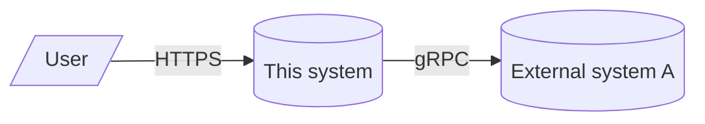
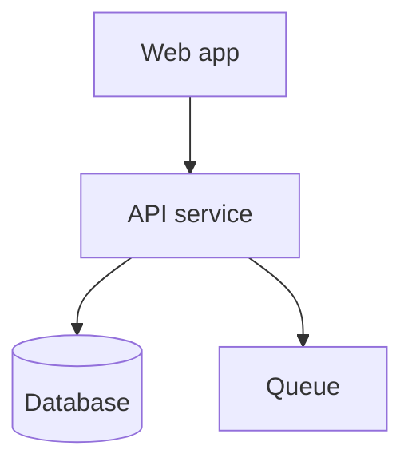

# Architecture: {{title}}

C4 model layers: System Context → Containers → Components → Code (last
omitted for most docs).

## Purpose

What system this document describes, who needs to read it, and what
decisions it should ground.

## System context (C4 L1)

The system in relation to its users and the external systems it depends on
or serves.

## Containers (C4 L2)

The deployable units (services, databases, queues, frontends) and how they
communicate.

| Container | Tech | Responsibility | Persistence |
| --------- | ---- | -------------- | ----------- |
| Web app | … | … | none |
| API service | … | … | none |
| Database | … | … | … |

## Components (C4 L3)

Inside the most interesting container. Show the major modules and how they
collaborate.

## Cross-cutting concerns

- AuthN / AuthZ
- Observability (logs, metrics, traces — link to runbooks)
- Data classification
- Failure modes and degraded states

## References

- PRD: `{{prd_link}}`
- ADRs: ADR-…, ADR-…
